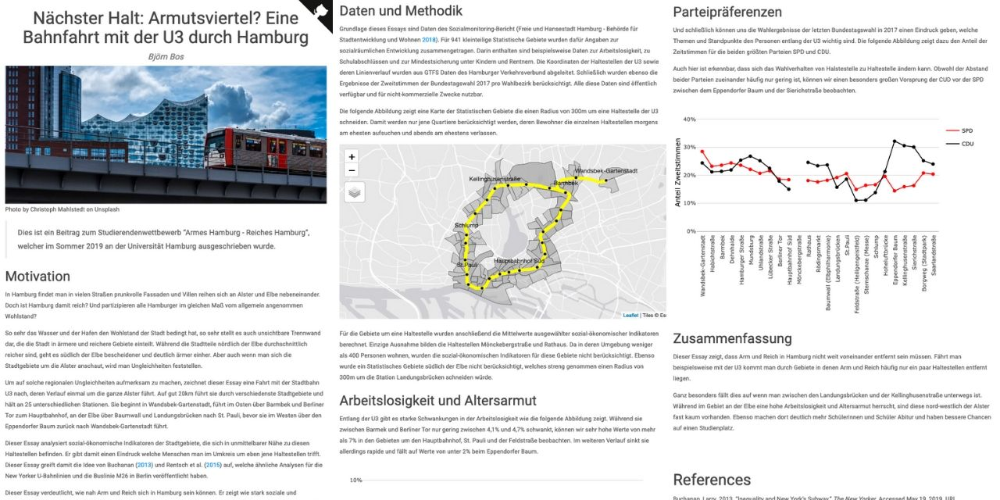

# Beitrag zum Wettbewerb "Armes Hamburg - Reiches Hamburg"

Arm und Reich sind häufig nicht weit voneinander entfernt. Dieser Essay zeigt regionale Unterschiede entlang der Linie U3 in Hamburg. Er ist ein Beitrag zum Wettbewerb "Armes Hamburg - Reiches Hamburg", welcher im Sommer 2019 an der Universität Hamburg ausgeschrieben wurde.

[Zum PDF](https://github.com/bjoernbos/beitrag_armes_hh_reiches_hh/blob/master/04_docs/Latex/Essay.pdf)

[Zur interaktiven Website](https://bjoernbos.github.io/beitrag_armes_hh_reiches_hh/)

## Idee
In Hamburg findet man in vielen Straßen prunkvolle Fassaden und Villen reihen sich an Alster und Elbe nebeneinander. Doch ist Hamburg damit reich? Und partizipieren alle Hamburger im gleichen Maß vom allgemein angenommen Wohlstand?

Um auf regionalen Ungleichheiten aufmerksam zu machen, zeichnet dieser Essay eine Fahrt mit der Stadtbahn U3 nach, deren Verlauf einmal um die ganze Alster führt. Auf Basis von Daten des Sozialmonitoring Bericht 2018 zeigt er, dass Arm und Reich häufig nur ein paar Haltestellen voneinander entfernt sind.

## Daten
Die grundlegenden Daten stammen aus folgenden frei verfügbaren Quellen:

* Informationen zur sozialräumlichen Entwicklung stammen aus dem [Sozialmonitoring Bericht 2018](https://www.hamburg.de/sozialmonitoring). Für 941 Statistische Gebiete innerhalb Hamburgs sind darin beispielsweise Informationen zur Arbeitslosigkeit, zu Schulabschlüssen und zur Mindestsicherung unter Kindern und Rentnern angegeben.

* Die [Ergebnisse der letzten Bundestagswahl 2017](https://www.bundeswahlleiter.de/bundestagswahlen/2017/ergebnisse/weitere-ergebnisse.html) sind pro Wahlkreis vom Bundeswahlleiter abgerufen worden.

* Und schließlich stammen die Koordinaten der Haltestellen der Linie U3, sowie deren Linienverlauf aus [GTFS Daten des Hamburg Verkehrsverbund](suche.transparenz.hamburg.de/dataset/hvv-fahrplandaten-gtfs-mai-2019-bis-dezember-2019).

## Reproduktion
Um die Analyse nachzuvollziehen und den Essay zu reproduzieren ist der gesamte Code in diesem Repository verfügbar. Er wurden unter `R 3.5.1` geschrieben und benötigt u.a. die Packages `tidyverse`, `sf` sowie `tmap`. Die jeweiligen Versionsnummer für diese Packages sowie Details zu weiteren Packages sind in der Datei `sessionInfo.txt` enthalten.

Im Ordner `03_code` ist der Code zum Herunterladen der Daten, zur Datenaufbereitung, sowie zur Erstellung der Karten und Grafiken enthalten.

Bei entsprechendem Betriebssystem und Konfiguration kann der Code und die interaktive Website auch über das Bash-Skript `build.sh` reproduziert werden.

## Author
Björn Bos – [Mail](mailto:bjoern.bos@web.de)
